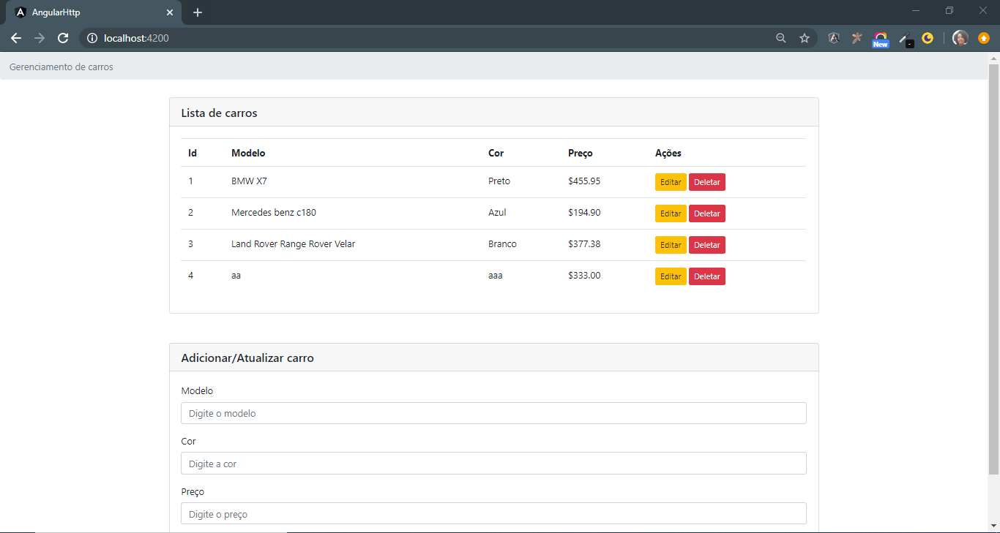

## Angular HttpClient

Comunicação entre cliente e servidor usando o  protocolo http
post()
get()
put()
delete()
patch()
request()
head()
jsonp()
options()

**O pacote @angular/http foi depreciado na versão 5 e removido na versão 8 do angular. O novo paote chama-se @angular/common/http**
_skipTests=true Cria uma classe ou interface sem arquivos de testes_
#### Benefícios

O HttpClient usa a interface XMLHttpRequest que também suporta a navegadores antigos, além de fácil de usar disponibiliza benefícios, como:
* Solicitações de request e response interceptadas
* Manipulação de erros simplificada
* Suporte a api Observable
* APIs e tratamentos de erros

Para simular o uso do HttpClient, precisamos de uma API REST, como o foco é o HttpClient não vamos nos preocupar em criar uma API REST, para isso podemos usar o json-server, que faz uma API REST fake, assim focaremos no HttpClient.
Para mais detalhes sobre o json-server, podemos consultar seu github.
Para instalar o json-server, bastar executar o seguinte comando:
      _npm install -g json-server_
      
 * Para usar o HttpClient, precisamos adicionar o modulo HttpClientModule no arquivo app.module.ts.
 * O angular recomenda que métodos de manipulação de erros deve ser nos services e não nos componentes.
 
 ###### O subscribe é um dos operadores mais importantes do Observable da biblioteca RxJS, ele notificará assim que a resposta vier e for transformada em Json, nos retornando um array 
 *json-server --watch src/assets/data/db.json - Para rodar o backend, no caso o json*
 
 Tutorial:https://medium.com/@fernandoevangelista_28291/consumindo-api-rest-com-httpclient-no-angular-8-62c5d733ffb6
